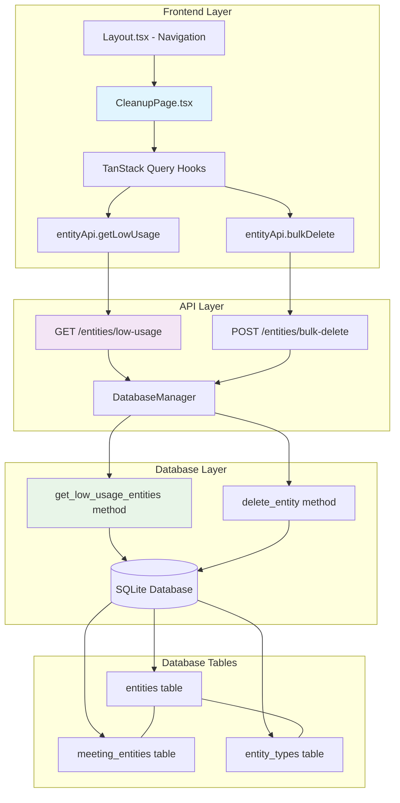

# OSS-266: Entity Cleanup Feature - Architecture

## High-Level System Overview

### Current System
The application has a robust entity management system with:
- **Backend**: FastAPI with SQLite database using `DatabaseManager` abstraction
- **Frontend**: React TypeScript with shadcn/ui components, TanStack Query for state management
- **Navigation**: Top bar with 4 main sections: Feed, Meetings, Entities, Admin
- **Entity Management**: Full CRUD operations, bulk operations (delete/update type), card-based UI
- **Database Schema**: 
  - `entities` table with entity data
  - `meeting_entities` junction table for many-to-many relationships
  - Existing indexes for performance

### Proposed System (After Feature)
Add a **"Cleanup"** section accessible from the top bar that provides:
- Query for low-engagement entities (≤1 meeting associations)
- Multi-select interface for bulk entity removal
- Confirmation workflow with error handling

## Component Architecture

### Backend Components

#### 1. Database Layer Extensions
**File**: `backend/app/database.py`
- **New Method**: `get_low_usage_entities()` 
  ```sql
  SELECT e.*, et.name as type_name, et.color_class as type_color_class,
         COALESCE(COUNT(me.meeting_id), 0) as meeting_count
  FROM entities e
  LEFT JOIN entity_types et ON e.type_slug = et.slug
  LEFT JOIN meeting_entities me ON e.id = me.entity_id
  GROUP BY e.id, e.name, e.type_slug, e.description, e.created_at
  HAVING COUNT(me.meeting_id) <= 1
  ORDER BY e.name
  ```

#### 2. API Layer Extensions  
**File**: `backend/app/api/routes.py`
- **New Endpoint**: `GET /api/v1/entities/low-usage`
  - Returns entities with ≤1 meeting associations
  - Uses existing `EntityWithType` response model
- **Leverage Existing**: `POST /api/v1/entities/bulk-delete` (already implemented)

#### 3. Models Extensions
**File**: `backend/app/models.py`
- **Reuse Existing**: `EntityWithType`, `EntityBulkDelete` models
- **No New Models Required**: Current models support the use case

### Frontend Components

#### 1. Navigation Extension
**File**: `frontend/src/components/layout/Layout.tsx`
- **Modification**: Add "Cleanup" button to top bar (last position)
- **Pattern**: Follow existing navigation pattern with Lucide React icons
- **Icon**: `Trash2` icon to represent cleanup functionality

#### 2. New Route and Page
**File**: `frontend/src/App.tsx`
- **New Route**: `/cleanup` pointing to `CleanupPage`

**New File**: `frontend/src/pages/CleanupPage.tsx`
- **Component Architecture**:
  - TanStack Query for data fetching (`useQuery` for entities, `useMutation` for deletion)
  - State management with React hooks for checkbox selections
  - Card-based layout following existing `EntitiesPage` patterns
  - Confirmation modal with simple "Delete X entities?" message
  - Error display using existing Alert components

#### 3. API Integration
**File**: `frontend/src/lib/api.ts`  
- **Extend Existing**: `entityApi.getLowUsage()` method (already defined, needs backend implementation)
- **Reuse Existing**: `entityApi.bulkDelete()` method

#### 4. Type Definitions
**File**: `frontend/src/types/index.ts`
- **Reuse Existing**: `Entity` interface (with type information)
- **No New Types Required**: Current type system covers the needs

## Implementation Dependencies

### External Dependencies
- **No New Dependencies**: Leverages existing stack
- **Lucide React**: Already available for `Trash2` icon
- **TanStack Query**: Already available for state management
- **shadcn/ui Components**: Card, Button, Checkbox, Alert already available

### Internal Dependencies
- **Database Schema**: Uses existing `entities`, `meeting_entities`, `entity_types` tables
- **Existing Patterns**: Follows established patterns from `EntitiesPage`
- **API Patterns**: Uses existing FastAPI route patterns and error handling

## Patterns and Best Practices

### Frontend Patterns
1. **Component Structure**: Follow `EntitiesPage.tsx` card-based layout patterns
2. **State Management**: 
   - TanStack Query for server state (`useQuery`, `useMutation`)
   - React hooks for local UI state (checkbox selections)
3. **Error Handling**: Use existing Alert component pattern
4. **UI/UX**: 
   - Card-based entity display with checkboxes
   - Bulk selection patterns (individual + select all)
   - Modal confirmation dialogs

### Backend Patterns  
1. **Database Access**: Use existing `DatabaseManager` async context patterns
2. **Error Handling**: Follow existing HTTPException patterns with proper status codes
3. **API Design**: RESTful endpoints with existing response model patterns
4. **Logging**: Use existing loguru logger patterns

## Constraints and Assumptions

### Constraints
- **Database**: Must use current SQLite setup (no SurrealDB migration)
- **Performance**: No pagination required (load all qualifying entities)
- **UI Framework**: Must use existing shadcn/ui component system
- **Navigation**: Must integrate into existing top bar structure

### Assumptions
- **Entity Volume**: Low-usage entities count will be manageable (< 1000)
- **User Workflow**: Users will periodically run cleanup (not automated)
- **Permission Model**: All users can access cleanup (no auth restrictions)
- **Data Recovery**: Hard delete is acceptable (no soft delete required)

## Trade-offs and Alternatives

### Chosen Approach: Dedicated Cleanup Page
**Pros:**
- Clean separation of concerns
- Focused user experience
- Easy to find and use
- Consistent with app navigation patterns

**Alternative**: Cleanup functionality within Entities page
**Rejected Because:**
- Would clutter the main entities interface
- Harder to discover cleanup functionality
- Mixing operational and administrative concerns

### Database Query Approach: LEFT JOIN with COUNT
**Pros:**
- Single query for all data needed
- Efficient with existing indexes
- Handles edge cases (entities with 0 meetings)

**Alternative**: Separate queries or subqueries
**Rejected Because:**
- Multiple database round trips
- More complex query coordination
- Potential inconsistency issues

## Consequences and Risks

### Positive Consequences
- **Improved Data Quality**: Users can maintain clean entity databases
- **Enhanced Performance**: Fewer unused entities improve query performance
- **Better UX**: Focused entity lists without noise
- **Administrative Control**: Clear operational tool for database maintenance

### Negative Consequences  
- **Data Loss Risk**: Hard delete with simple confirmation (mitigated by confirmation modal)
- **User Error**: Accidental bulk deletion (mitigated by clear confirmation messaging)

### Implementation Risks
- **Low**: Well-established patterns, existing bulk operations prove the approach
- **Database Performance**: Query should perform well with existing indexes
- **Frontend Complexity**: Manageable - similar to existing entities page patterns

## Files to be Edited/Created

### Backend Files
1. **Edit**: `backend/app/database.py` - Add `get_low_usage_entities()` method
2. **Edit**: `backend/app/api/routes.py` - Add `GET /entities/low-usage` endpoint  

### Frontend Files
1. **Edit**: `frontend/src/components/layout/Layout.tsx` - Add Cleanup button to navigation
2. **Edit**: `frontend/src/App.tsx` - Add `/cleanup` route
3. **Create**: `frontend/src/pages/CleanupPage.tsx` - Main cleanup interface
4. **Edit**: `frontend/src/types/index.ts` - Add `EntityLowUsage` interface (if needed)

### Estimated Effort
- **Backend**: ~2-3 hours (database method + endpoint)
- **Frontend**: ~4-5 hours (navigation + new page + integration)
- **Testing**: ~1-2 hours (manual testing + error scenarios)
- **Total**: ~7-10 hours

## Mermaid Architecture Diagram



The architecture leverages existing patterns and infrastructure while adding focused cleanup functionality through a dedicated interface accessible from the top navigation bar.