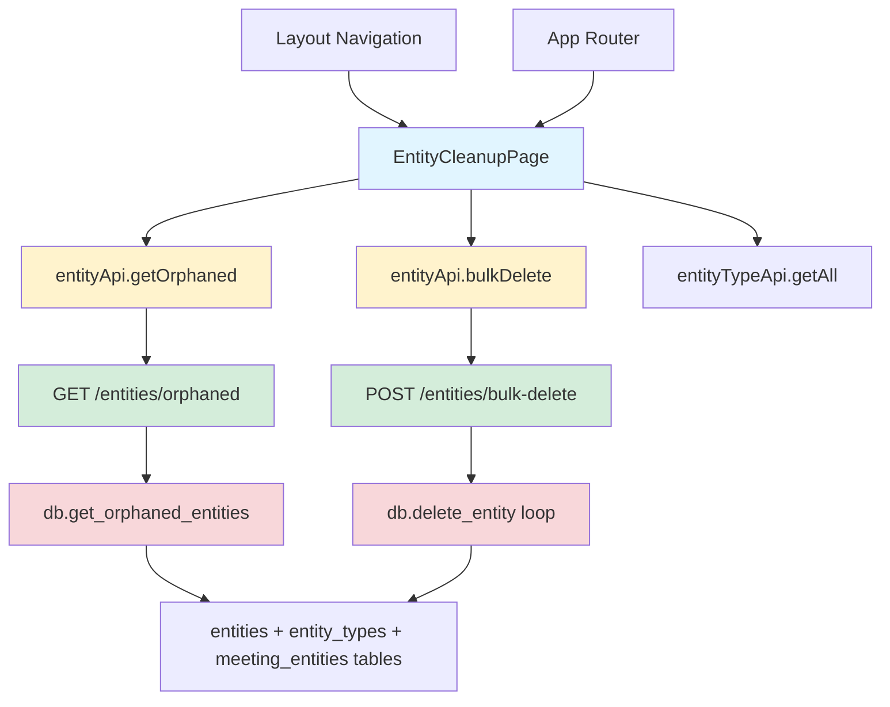

# OSS-271: Entity Cleanup Feature - Architecture Document

## High-Level Overview

### System Before Change
The current system has:
- Entity management with CRUD operations
- Bulk delete and bulk update type operations
- Entity-Meeting relationships via junction table
- No specific view for orphaned entities

### System After Change
The system will add:
- A new endpoint to query orphaned entities (0-1 meeting associations)
- A new frontend route/page for entity cleanup UI
- Enhanced navigation with "Entity Cleanup" menu item
- Confirmation modal pattern for bulk deletions

## Affected Components and Relationships

### Backend Components

#### 1. Database Manager (`backend/app/database.py`)
**Changes Required**: Add new method
- **New Method**: `get_orphaned_entities() -> List[EntityWithType]`
  - Query entities with LEFT JOIN to meeting_entities
  - GROUP BY entity_id, COUNT meetings
  - Filter WHERE count <= 1
  - Order by: meeting_count ASC, name ASC
  - Return EntityWithType objects (includes type info)

**SQL Query Pattern**:
```sql
SELECT e.*, et.name as type_name, et.color_class as type_color_class,
       COUNT(me.meeting_id) as meeting_count
FROM entities e
JOIN entity_types et ON e.type_slug = et.slug
LEFT JOIN meeting_entities me ON e.id = me.entity_id
GROUP BY e.id
HAVING meeting_count <= 1
ORDER BY meeting_count ASC, e.name ASC
```

**Dependencies**:
- Existing `EntityWithType` model ✅
- Existing database connection patterns ✅

#### 2. API Routes (`backend/app/api/routes.py`)
**Changes Required**: Add new endpoint

- **New Endpoint**: `GET /api/v1/entities/orphaned`
  - Response Model: `List[EntityWithType]`
  - Calls `db.get_orphaned_entities()`
  - No pagination needed (small result set expected)
  - Standard error handling pattern

**Pattern to Follow**:
```python
@router.get("/entities/orphaned", response_model=List[EntityWithType])
async def get_orphaned_entities(db: DatabaseManager = Depends(get_db)):
    """Get entities with 0 or 1 meeting associations"""
    try:
        return await db.get_orphaned_entities()
    except Exception as e:
        logger.error(f"Error getting orphaned entities: {e}")
        raise HTTPException(status_code=500, detail=str(e))
```

**Existing Endpoint to Reuse**:
- `POST /api/v1/entities/bulk-delete` (already exists at line 279-305)
- Takes `EntityBulkDelete` model with `ids: List[int]`
- Returns deletion count and failed IDs

**Dependencies**:
- Existing `EntityBulkDelete` model ✅
- Existing bulk delete logic ✅
- DatabaseManager dependency pattern ✅

#### 3. Models (`backend/app/models.py`)
**Changes Required**: None! All models already exist:
- ✅ `EntityWithType` (line 176-181) - includes type info
- ✅ `EntityBulkDelete` (line 89-90) - for bulk delete requests

### Frontend Components

#### 1. Types (`frontend/src/types/index.ts`)
**Changes Required**: Add new interface

```typescript
export interface OrphanedEntity extends Entity {
  meeting_count: number; // 0 or 1
}
```

#### 2. API Client (`frontend/src/lib/api.ts`)
**Changes Required**: Update `entityApi` object

Looking at the code, I see there are already placeholder methods:
- Line 89-90: `getLowUsage()` - not used
- Line 92-93: `getForCleanup()` - not used

**Decision**: Implement `getOrphaned()` method:
```typescript
getOrphaned: () =>
  api.get<Entity[]>('/entities/orphaned'),
```

#### 3. Navigation (`frontend/src/components/layout/Layout.tsx`)
**Changes Required**: Add new menu item

- Add to `navigation` array (line 16-21) as LAST element:
```typescript
const navigation = [
  { name: 'Feed', href: '/', icon: Home },
  { name: 'Meetings', href: '/meetings', icon: Calendar },
  { name: 'Entities', href: '/entities', icon: Users },
  { name: 'Admin', href: '/admin', icon: Settings },
  { name: 'Entity Cleanup', href: '/entity-cleanup', icon: Trash2 }, // NEW
];
```

**Icon Import**: Add `Trash2` to imports from `lucide-react`

#### 4. Router (`frontend/src/App.tsx`)
**Changes Required**: Add new route

```typescript
import EntityCleanupPage from '@/pages/EntityCleanupPage';

// In Routes:
<Route path="/entity-cleanup" element={<EntityCleanupPage />} />
```

#### 5. New Page Component (`frontend/src/pages/EntityCleanupPage.tsx`)
**New File**: Complete implementation following EntitiesPage.tsx patterns

**Component Structure**:
```typescript
export default function EntityCleanupPage() {
  // State
  const queryClient = useQueryClient();
  const [selectedEntityIds, setSelectedEntityIds] = useState<Set<number>>(new Set());
  const [isConfirmModalOpen, setIsConfirmModalOpen] = useState(false);
  const [error, setError] = useState<string | null>(null);

  // Queries
  const { data: orphanedEntities, isLoading } = useQuery({
    queryKey: ['entities', 'orphaned'],
    queryFn: () => entityApi.getOrphaned(),
  });

  const { data: entityTypes } = useQuery({
    queryKey: ['entity-types'],
    queryFn: () => entityTypeApi.getAll(),
  });

  // Mutations
  const bulkDeleteMutation = useMutation({
    mutationFn: (ids: number[]) => entityApi.bulkDelete(ids),
    onSuccess: () => {
      queryClient.invalidateQueries({ queryKey: ['entities'] });
      queryClient.invalidateQueries({ queryKey: ['entities', 'orphaned'] });
      setSelectedEntityIds(new Set());
      setIsConfirmModalOpen(false);
      setError(null);
    },
    onError: (error: any) => {
      setError(error.response?.data?.detail || 'Failed to delete entities');
    },
  });

  // Handlers
  const toggleEntitySelection = (entityId: number) => { ... };
  const toggleSelectAll = () => { ... };
  const handleDeleteClick = () => setIsConfirmModalOpen(true);
  const confirmDelete = () => {
    const idsArray = Array.from(selectedEntityIds);
    bulkDeleteMutation.mutate(idsArray.map(Number));
  };

  // Render
  return (
    <div className="space-y-6">
      {/* Header with title and description */}
      {/* Statistics section (counts by meeting_count: 0 vs 1) */}
      {/* Entity list with checkboxes */}
      {/* Confirmation modal */}
    </div>
  );
}
```

**UI Sections**:

1. **Header**
   - Title: "Entity Cleanup"
   - Description: "Remove entities that appear in 0 or 1 meetings"
   - Action button: "Delete Selected (X)" - only shows when selection > 0

2. **Statistics Cards** (using Card component)
   - Card 1: "Entities with 0 Meetings" - count
   - Card 2: "Entities with 1 Meeting" - count
   - Card 3: "Total Orphaned Entities" - count

3. **Entity List**
   - Grouped display:
     - Section 1: "No Meetings (X entities)" - alphabetically sorted
     - Section 2: "One Meeting (X entities)" - alphabetically sorted
   - Each entity card shows:
     - Checkbox for selection
     - Entity icon (based on type)
     - Name and type badge
     - Description (if exists)
     - Meeting count indicator

4. **Confirmation Modal** (using Card in fixed overlay)
   - Title: "Confirm Deletion"
   - Body:
     - "You are about to delete X entities."
     - Type breakdown: "• 5 People\n• 3 Companies\n• 2 Projects"
     - Warning: "This action cannot be undone."
   - Actions:
     - "Cancel" button (outline variant)
     - "Delete X Entities" button (destructive variant)

**Pattern Reference**:
- Follow `EntitiesPage.tsx` patterns (lines 29-640)
- Checkbox selection pattern (lines 239-255)
- Modal overlay pattern (lines 497-577)
- Error handling pattern (lines 80-117)
- TanStack Query patterns (lines 45-149)

## External Dependencies

### Existing (No Installation Needed)
- ✅ FastAPI, aiosqlite, pydantic (backend)
- ✅ React, React Router, TanStack Query (frontend)
- ✅ shadcn/ui components: Card, Button, Checkbox, Badge, Alert
- ✅ lucide-react icons
- ✅ axios for API calls

### New (Need to Import)
- `Trash2` icon from lucide-react (in Layout.tsx)

## Patterns and Best Practices

### Backend Patterns
1. **Database Method Pattern**:
   - Async methods with proper connection management
   - Use `@asynccontextmanager` for connections
   - Return Pydantic models for type safety
   - Log operations with loguru

2. **API Endpoint Pattern**:
   - Use dependency injection for DatabaseManager
   - Wrap in try/except with HTTPException
   - Log errors before raising
   - Return proper response models

3. **Query Pattern**:
   - Use JOIN for related data (not multiple queries)
   - Use GROUP BY + HAVING for aggregations
   - Order results in SQL, not in Python

### Frontend Patterns
1. **Component Organization**:
   - Pages in `/pages` directory
   - Follow existing page structure (header, content, modals)
   - Use semantic HTML structure

2. **State Management**:
   - TanStack Query for server state
   - React hooks (useState) for local UI state
   - useQueryClient for cache invalidation

3. **API Patterns**:
   - Centralized API calls in `/lib/api.ts`
   - Response type safety with TypeScript interfaces
   - Error handling in mutation callbacks

4. **Modal Pattern** (from EntitiesPage.tsx):
   - Fixed overlay with centered Card
   - Form submission handling
   - Loading states on buttons
   - Cancel/Confirm action buttons

5. **Selection Pattern**:
   - Use Set<number> for selected IDs
   - Toggle individual and select all handlers
   - Visual feedback (ring on selected cards)

## Constraints and Assumptions

### Constraints
1. **No New Dependencies**: Use existing shadcn/ui components
2. **SQLite Limitations**: No window functions, simple aggregations only
3. **Existing Patterns**: Follow established code conventions
4. **Single-User App**: No auth/permissions needed

### Assumptions
1. **Small Dataset**: Orphaned entities list won't need pagination
2. **Fast Queries**: COUNT aggregation on small tables is performant
3. **Cascade Delete Works**: Foreign key cascade already configured
4. **No Action Item Impact**: assignee field is TEXT, not FK

## Trade-offs and Alternatives

### Decision: Use Custom Confirmation Modal
**Chosen**: Custom modal using Card + fixed overlay (matching EntitiesPage pattern)
**Alternative**: Browser `window.confirm()`
**Rationale**:
- ✅ Better UX with detailed breakdown by type
- ✅ Consistent with bulk delete pattern in EntitiesPage
- ✅ Allows for richer information display
- ❌ More code than window.confirm
- **Verdict**: Better UX justifies extra code

### Decision: Single Endpoint vs Multiple
**Chosen**: Single `GET /entities/orphaned` endpoint
**Alternative**: Filter parameter on existing `/entities` endpoint
**Rationale**:
- ✅ Clear, specific purpose
- ✅ Different query logic (JOIN + aggregation)
- ✅ Easier to understand and maintain
- ❌ One more endpoint
- **Verdict**: Clarity over DRY

### Decision: Group Display vs Flat List
**Chosen**: Visually grouped (0 meetings, then 1 meeting)
**Alternative**: Flat sorted list with meeting count column
**Rationale**:
- ✅ Matches sorting requirement
- ✅ Easier to scan visually
- ✅ Clear separation of concerns
- **Verdict**: Better UX

## Negative Consequences

1. **No Undo**: Hard delete is permanent
   - **Mitigation**: Confirmation modal with clear warning

2. **Lost Entity Relationships**: Deleted entities remove meeting context
   - **Mitigation**: Only targets low-value entities (0-1 meetings)

3. **No Audit Trail**: No record of deletion
   - **Mitigation**: Single-user app, not needed for MVP

4. **Query Performance**: COUNT aggregation on every page load
   - **Mitigation**: Small dataset, fast query, could add caching later

## Files to Edit/Create

### Backend Files to Edit
1. ✏️ `backend/app/database.py` - Add `get_orphaned_entities()` method
2. ✏️ `backend/app/api/routes.py` - Add `GET /entities/orphaned` endpoint

### Backend Files (No Changes Needed)
- ✅ `backend/app/models.py` - All models exist

### Frontend Files to Edit
1. ✏️ `frontend/src/types/index.ts` - Add `OrphanedEntity` interface (optional)
2. ✏️ `frontend/src/lib/api.ts` - Add `getOrphaned()` method
3. ✏️ `frontend/src/components/layout/Layout.tsx` - Add menu item + Trash2 icon
4. ✏️ `frontend/src/App.tsx` - Add route

### Frontend Files to Create
1. ➕ `frontend/src/pages/EntityCleanupPage.tsx` - New page component (~400-500 lines)

## Implementation Order

1. **Backend Foundation** (database query)
   - Add `get_orphaned_entities()` to DatabaseManager
   - Test query returns correct entities, sorted properly

2. **Backend API** (endpoint)
   - Add `GET /entities/orphaned` route
   - Test endpoint returns JSON correctly

3. **Frontend API Client** (connectivity)
   - Add `getOrphaned()` to entityApi
   - Test API call works

4. **Frontend Navigation** (routing)
   - Add menu item to Layout
   - Add route to App
   - Create stub EntityCleanupPage

5. **Frontend Component** (UI implementation)
   - Build page layout (header, stats, list)
   - Add selection logic
   - Add confirmation modal
   - Wire up delete mutation
   - Handle loading/error states

6. **Integration Testing** (end-to-end)
   - Test full flow: view → select → confirm → delete → refresh
   - Verify cache invalidation works
   - Test edge cases (0 orphaned, all selected, etc.)

## Component Dependencies Graph



## Summary

This architecture follows existing patterns in the codebase:
- Backend: Simple database method + API endpoint
- Frontend: New page component following EntitiesPage patterns
- No new dependencies required
- Reuses existing bulk delete logic
- Clear separation of concerns
- Type-safe throughout

The implementation is straightforward and maintainable, with no breaking changes to existing functionality.